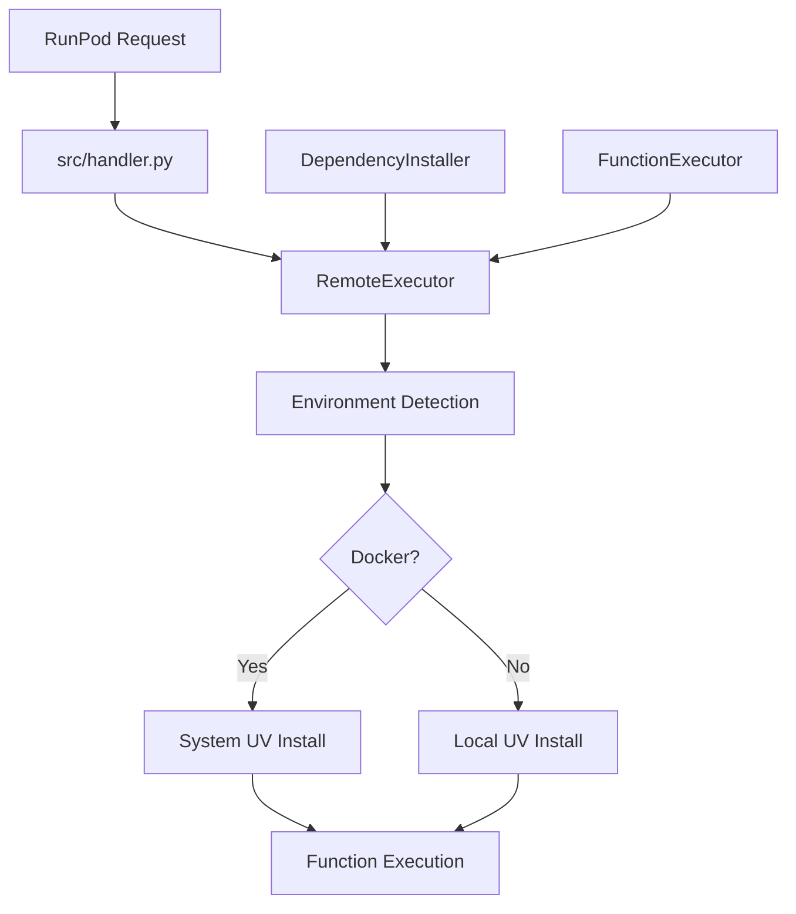
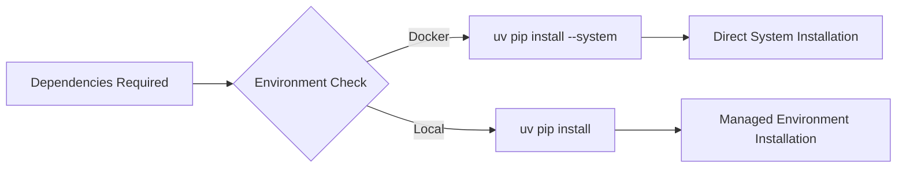
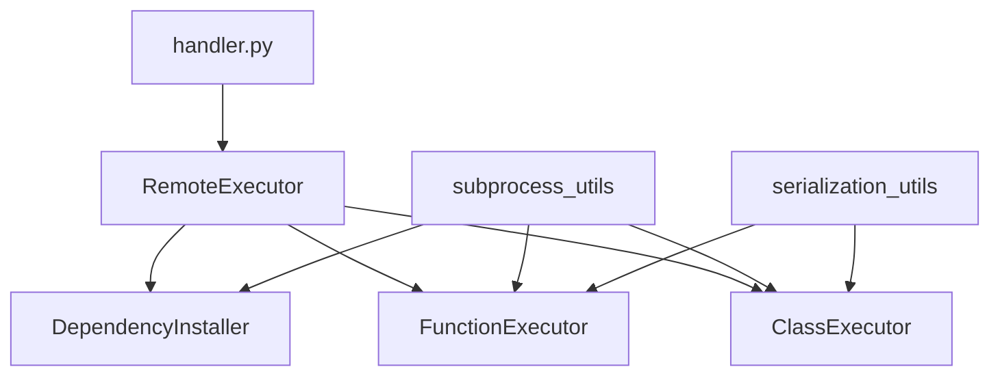

# System Python Runtime Architecture

## Overview

This design addresses full use of PyTorch installation built into the base Docker image that we use for the runtime.

## Architecture Design

### System Python Runtime



## Key Points


### Dependency Installation Strategy



### Component Architecture



## Benefits

### Improved Reliability
- **Environment detection** handles Docker vs local contexts
- **Centralized subprocess handling** through `run_logged_subprocess`
- **Consistent error handling** via `FunctionResponse` pattern

### Performance Optimizations
- **Faster cold starts** without venv initialization
- **Reduced container size** from simplified builds
- **Direct package access** eliminates the re-downloading torch and other built-in libraries

## Implementation Details

### System Installation Strategy
```python
# Docker environment
command = ["uv", "pip", "install", "--system"] + packages

# Local environment
command = ["uv", "pip", "install", "--python-preference=managed"] + packages
```

This architecture refactor addresses the core PyTorch installation issues while maintaining API compatibility and improving operational simplicity.

## Base Image Python Layout

### GPU Base Image (`runpod/pytorch:1.0.3-cu1281-torch291-ubuntu2204`)

The GPU base image installs Python interpreters 3.9 through 3.14 via the deadsnakes PPA. These multiple interpreters exist to support interactive pod and notebook use cases where users may need a specific Python version. However, for serverless workers, only Python 3.12 is usable because:

1. **torch and CUDA packages are installed only for 3.12.** The base image runs `pip install torch` under 3.12, so the compiled `.so` files and ABI tags target `cp312`. No other interpreter has these packages available.
2. **C-extension wheels must match the interpreter ABI.** Packages like numpy, Pillow, and tokenizers ship pre-compiled wheels tagged to a specific CPython version (e.g., `cp312-cp312-linux_x86_64`). Installing them under a different interpreter requires recompilation or downloading a different wheel.
3. **The `python` symlink points to 3.12.** The base image runs `ln -sf /usr/bin/python3.12 /usr/local/bin/python`, so all unqualified `python` invocations use 3.12.

### Symlink Setup

```
/usr/local/bin/python  -> /usr/bin/python3.12
/usr/local/bin/python3 -> /usr/bin/python3.12
```

When the worker runs `uv pip install --system`, packages install into the 3.12 site-packages directory, coexisting with the pre-installed torch and CUDA libraries.

### CPU Base Images

CPU images use `python:X.Y-slim` (Debian-based) where only a single Python version is present. The `PYTHON_VERSION` build arg selects which base image to use (3.10, 3.11, or 3.12). There is no ambiguity about which interpreter is active.
